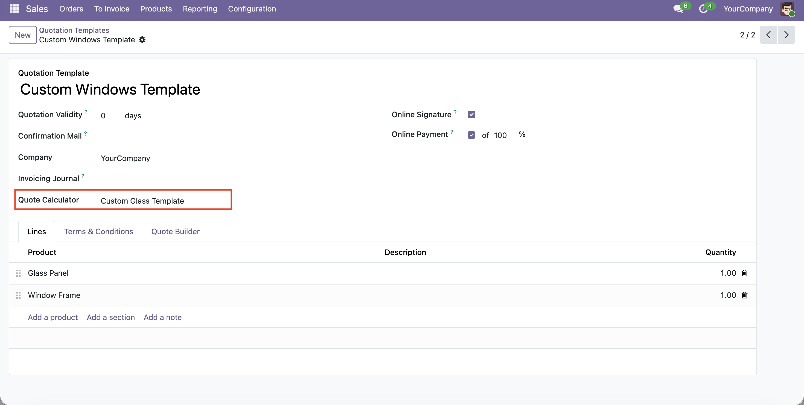
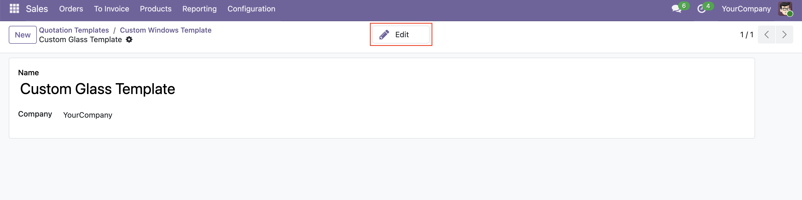
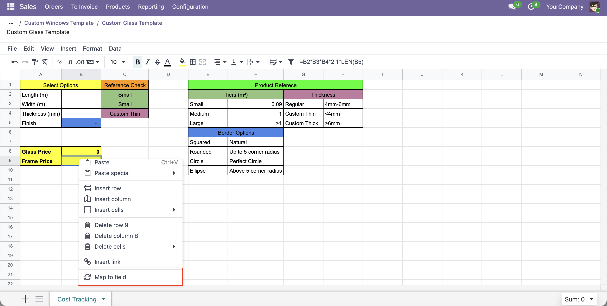
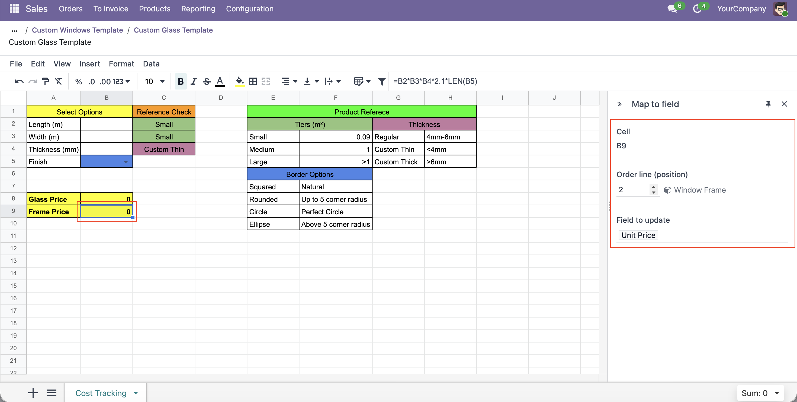

A calculator is prepared once on a **quotation template**, then reused by every quote created from that template.

1.  Go to **Sales \> Configuration \> Quotation Templates** and open (or create) a template. Add its lines as usual.
2.  In the **Quote Calculator** field, create a new calculator and open it. It starts empty — you build whatever calculation you need with ordinary spreadsheet formulas.

3.  Right-click a **result cell** → **Map to field**. In the side panel, pick:
    - the **line position** (`1` = the template's first product line, `2` = its second, ...) — the panel shows which line that position resolves to;
    - the **field** to feed (any writable field on the sale order line — unit price, quantity, discount, description, ...).

A mapping is stored per cell inside the workbook, so it survives save/reload and follows the cell if rows move.

