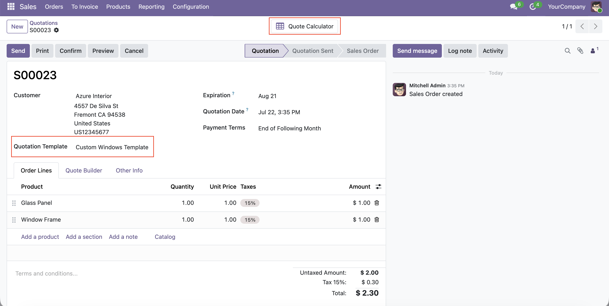
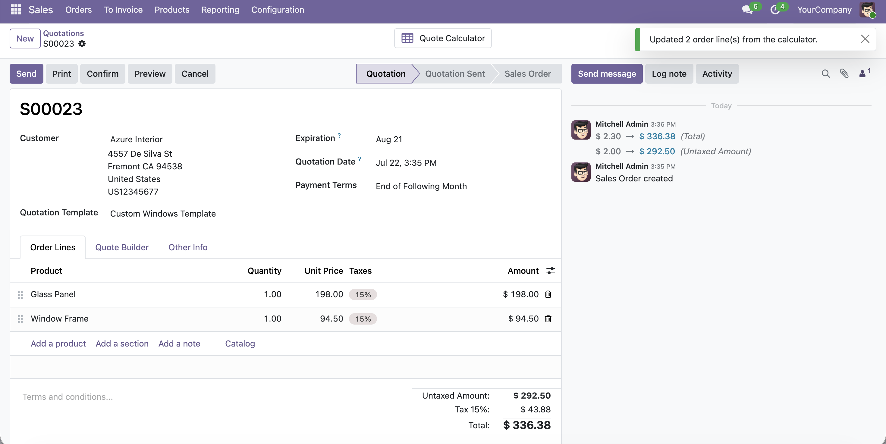

1.  Create a new quotation and select a customer and the quotation template that carries a calculator. Odoo copies the calculator onto the quote; the same mappings now resolve against the **order's** lines (position `1` = the order's first product line, and so on — order lines are created from the template lines in the same order, so nothing is remapped on copy).
2.  Click the **Quote Calculator** smart button on the quotation to open the editor, and adjust any input values.

3.  Click **Write to order**. For each mapped cell the computed value is read, type-checked against the field, and written onto the line at its position; the workbook is then saved.

Notes:

- An **empty/cleared** cell clears its field to the empty value (`0`, blank text, no relation).
